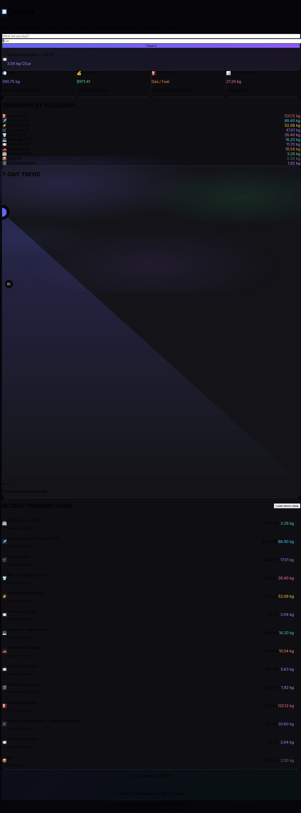
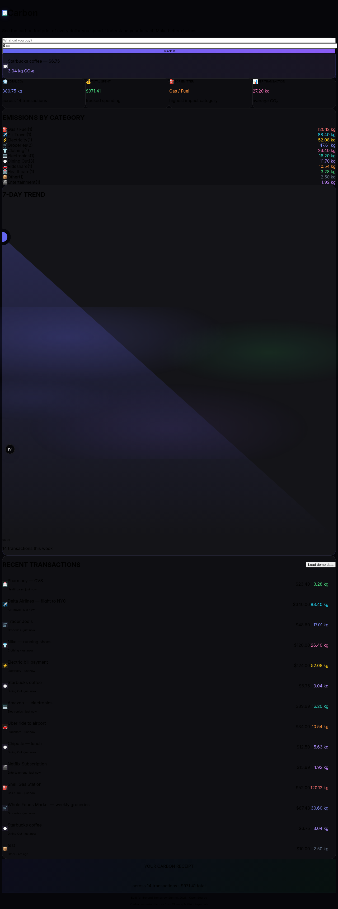
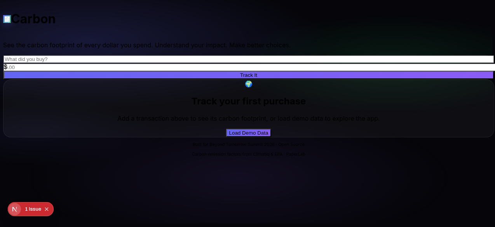

# 🧾 Carbonceipt

**Track the carbon footprint of every dollar you spend.**

Carbonceipt is an open-source web app that converts your spending into real-time CO₂ emissions. Enter any purchase — groceries, gas, flights — and see the environmental impact instantly.

**[Live Demo](http://localhost:3000)** · **[GitHub](https://github.com/scastile/carbonceipt)**



## The Problem

- The average American generates ~16 tonnes of CO₂/year
- Consumer spending drives 65% of global emissions
- Existing carbon trackers are paywalled (Joro: $60/yr, Commons: subscription)
- **No free, open-source tool exists for per-transaction carbon tracking**

## How It Works

1. **Add a transaction** — describe what you bought and how much you spent
2. **Auto-categorization** — keywords match your purchase to 17 categories
3. **CO₂ calculation** — emission factors from [Climatiq](https://climatiq.io/) and EPA data
4. **Visualize** — dashboard with per-category breakdowns, 7-day trends, and impact summaries



## Tech Stack

| Layer | Tech |
|-------|------|
| Frontend | Next.js 15, Tailwind CSS, TypeScript, Inter font |
| Backend | FastAPI, Python 3.12, SQLite, Pydantic |
| Carbon Data | Climatiq API + EPA/DEFRA fallback factors |
| Design | Dark theme, animated gradient mesh, glass-morphism |
| Deploy | Docker Compose (2 containers, ~100MB) |

## Quick Start

### Backend
```bash
cd backend
uv venv && source .venv/bin/activate
uv pip install -r requirements.txt
uvicorn main:app --reload --port 8000
```

### Frontend
```bash
cd frontend
npm install
npm run dev
# → http://localhost:3000
```

The frontend proxies API requests to the backend via `/api/proxy/*` routes.

### Docker
```bash
docker compose up --build
# Backend: http://localhost:8210
# Frontend: http://localhost:3000
```

## API Endpoints

| Method | Endpoint | Description |
|--------|----------|-------------|
| `POST` | `/transactions` | Create (`{description, amount}`) |
| `GET` | `/transactions` | List recent |
| `DELETE` | `/transactions/:id` | Delete one |
| `GET` | `/dashboard` | Aggregated stats |
| `GET` | `/categories` | CO₂ by category |
| `GET` | `/trends?days=7` | Daily trend |

## Screenshots

### Empty State


### Full Dashboard
*(see 01-dashboard.png above)*

### Transaction List
*(see 02-transactions.png above)*

## Future Scope

- [ ] Plaid bank integration (auto-import transactions)
- [ ] AI-powered merchant categorization
- [ ] Social features (leaderboards, challenges)
- [ ] Carbon offset marketplace integration
- [ ] Receipt OCR (snap a photo → track)
- [ ] Browser extension for auto-tracking

## License

MIT · Built by [PaperLab](https://paperlab.xyz) for [Beyond Tomorrow Summit 2026](https://beyond-tomorrow-summit-30094.devpost.com/)
